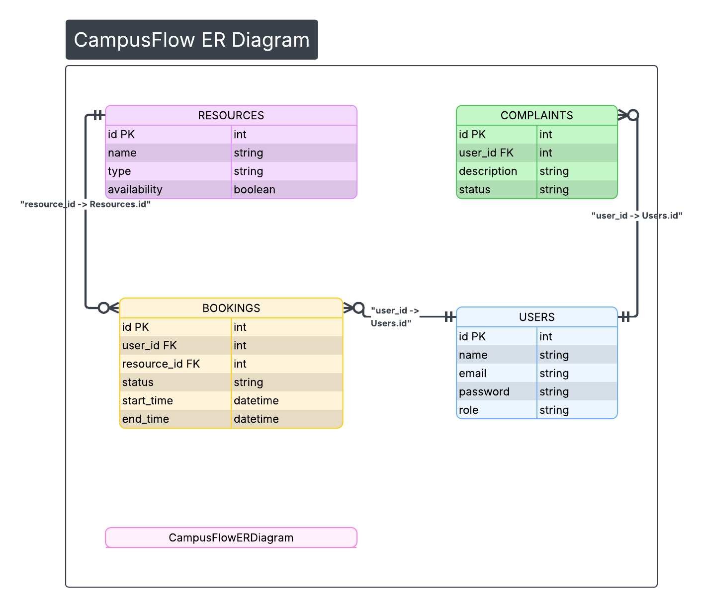

# ER Diagram – CampusFlow



## Entities

### Users

* id (PK)
* name
* email
* password
* role

### Resources

* id (PK)
* name
* type
* availability

### Bookings

* id (PK)
* user_id (FK)
* resource_id (FK)
* status
* start_time
* end_time

### Complaints

* id (PK)
* user_id (FK)
* description
* status

## Relationships

* One user can create many bookings
* One resource can have many bookings
* One user can raise many complaints

## ER Representation

```
Users ||--o{ Bookings
Resources ||--o{ Bookings
Users ||--o{ Complaints
```
