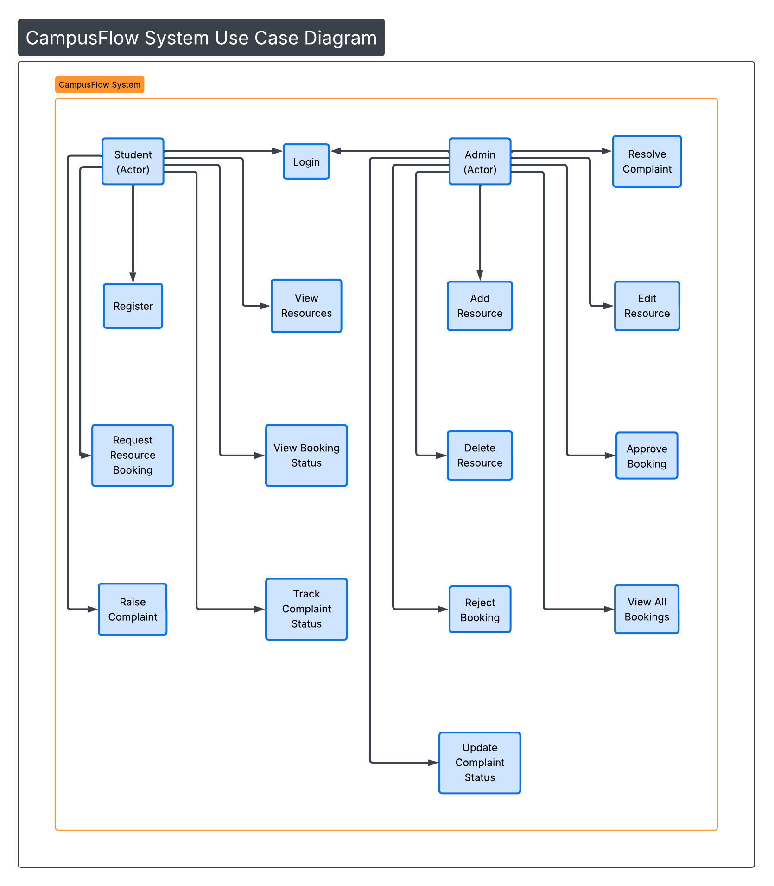
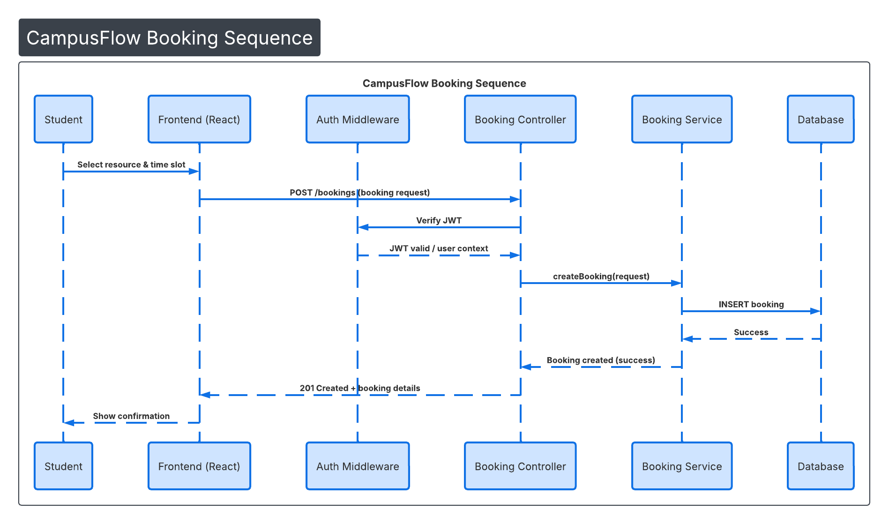
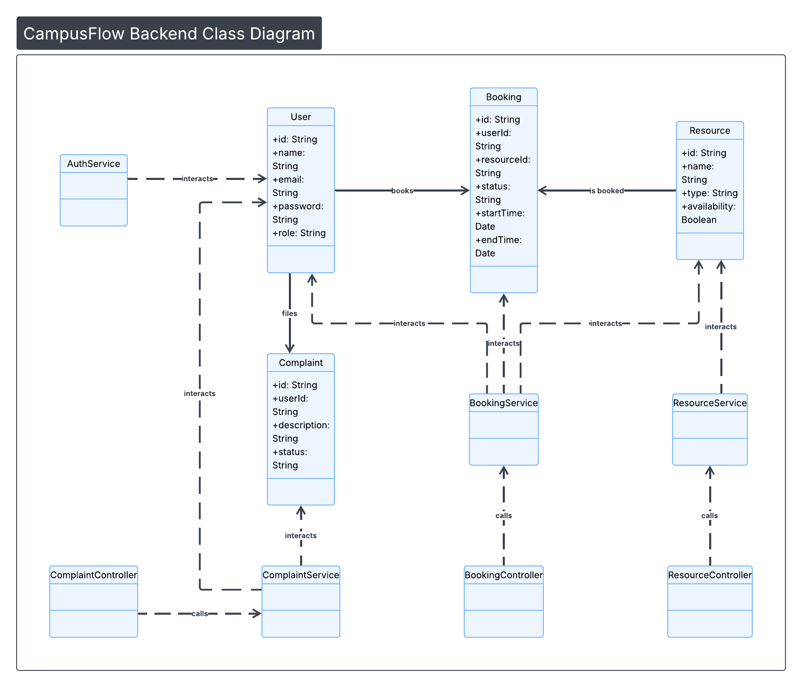
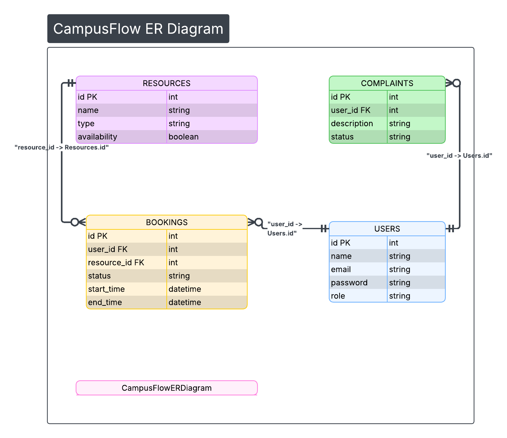

# CampusFlow

**College Resource Booking & Complaint Management System**

CampusFlow is a full-stack MERN application designed to manage college resources and student complaints in a centralized system.
The project focuses heavily on **backend architecture, system design, and clean software engineering practices**.

---

## 🚀 Problem

In many colleges, students book labs/classrooms or report issues through WhatsApp or Google Forms.
This causes:

* booking conflicts
* lost complaints
* no tracking
* no transparency

---

## 💡 Solution

CampusFlow provides a unified platform where:

Students can:

* view and book resources
* raise complaints
* track status

Admins can:

* manage resources
* approve/reject bookings
* resolve complaints

---

## 🧱 Tech Stack

**Frontend:** React + Tailwind
**Backend:** Node.js + Express
**Database:** MongoDB
**Auth:** JWT

---

## 🏗 Architecture

The backend follows a layered architecture:

```
Controllers → Services → Repositories/Models → Database
```

Principles used:

* OOP (encapsulation, abstraction)
* Clean architecture
* Separation of concerns
* RESTful API design

---

## 👥 Actors

* Student
* Admin

---

## ✨ Core Features

* JWT authentication
* Role-based access
* Resource booking workflow
* Complaint tracking
* Admin approval system
* Modular backend structure

---

## 📊 System Diagrams

### Use Case Diagram



### Sequence Diagram



### Class Diagram



### ER Diagram



---

## 📁 Project Structure

```
CampusFlow/
│
├── backend/
├── frontend/
├── docs/
   ├──images/
   |   ├── usecase.png
   |   ├── sequence.png
   |   ├── class.png
   |   └── er.png
   ├── idea.md
   ├── useCaseDiagram.md
   ├── sequenceDiagram.md
   ├── classDiagram.md
   ├── ErDiagram.md
   └── README.md
```

---

## 🧠 Backend Focus (Evaluation Weight: 75%)

This project emphasizes:

* layered backend structure
* service-based architecture
* proper data modeling
* scalable design

---

## 🔮 Future Improvements

* booking conflict detection
* email notifications
* analytics dashboard
* role expansion (faculty)

---

## 👨‍💻 Author

CampusFlow – SESD Milestone Project

---

## 🛠 Setup & Running Locally

### Prerequisites
* Node.js (v16 or higher)
* MongoDB (running locally or a cloud URI)

### Instructions
1. Install dependencies for both backend and frontend:
   ```bash
   cd backend && npm install
   cd ../frontend && npm install
   ```
2. In the `backend` folder, create a `.env` file containing:
   ```env
   PORT=8000
   MONGO_URI=mongodb://localhost:27017/campusflow
   JWT_SECRET=your_jwt_secret_here
   NODE_ENV=development
   ```
3. Seed the database with sample data:
   ```bash
   cd backend && npm run seed
   ```
4. Start both servers (open in separate terminals):
   ```bash
   cd backend && npm run dev
   cd frontend && npm run dev
   ```
5. Open your browser to `http://localhost:3000`

---

## 🔑 Demo Credentials
If you seeded the database successfully, you can use the following default credentials to test the application:

**Admin Role:**
* Email: `admin@campusflow.com`
* Password: `admin123`

**Student Role:**
* Email: `rohit@college.edu` (or `priya@college.edu`)
* Password: `student123`
