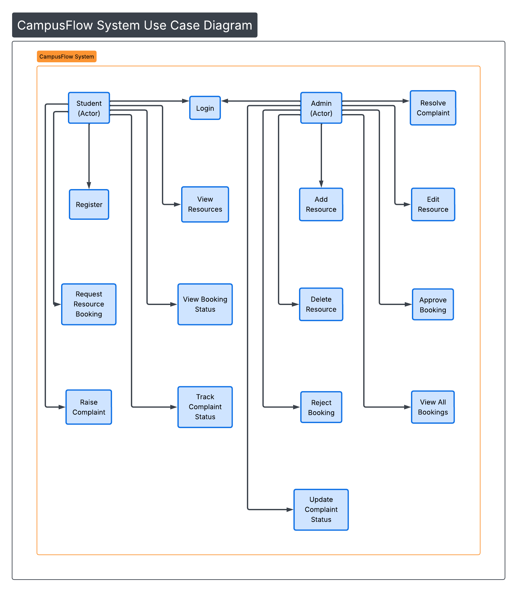

# Use Case Diagram – CampusFlow



## Actors

* Student
* Admin

## Student Use Cases

* Register
* Login
* View Resources
* Request Resource Booking
* View Booking Status
* Raise Complaint
* Track Complaint Status

## Admin Use Cases

* Login
* Add Resource
* Edit Resource
* Delete Resource
* Approve Booking
* Reject Booking
* View All Bookings
* Update Complaint Status
* Resolve Complaint

## System Boundary

CampusFlow System includes:

* authentication module
* booking module
* complaint module
* admin management module

## PlantUML Representation

```
@startuml
left to right direction

actor Student
actor Admin

Student --> (Register)
Student --> (Login)
Student --> (View Resources)
Student --> (Request Booking)
Student --> (View Booking Status)
Student --> (Raise Complaint)
Student --> (Track Complaint)

Admin --> (Login)
Admin --> (Add Resource)
Admin --> (Edit Resource)
Admin --> (Delete Resource)
Admin --> (Approve Booking)
Admin --> (Reject Booking)
Admin --> (View All Bookings)
Admin --> (Update Complaint Status)
Admin --> (Resolve Complaint)

@enduml
```
